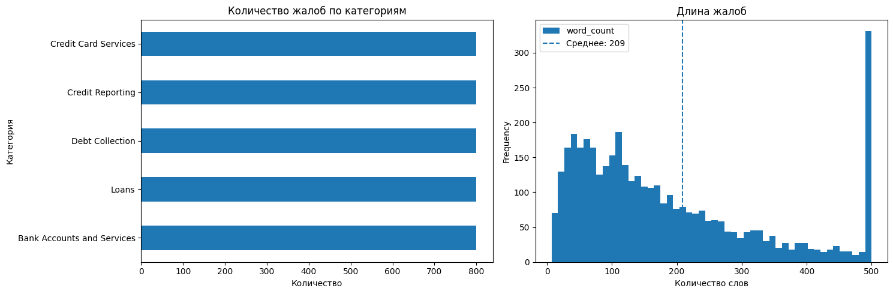
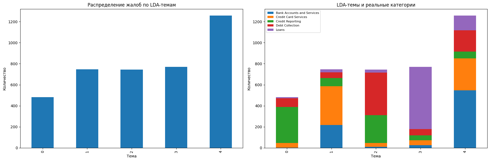
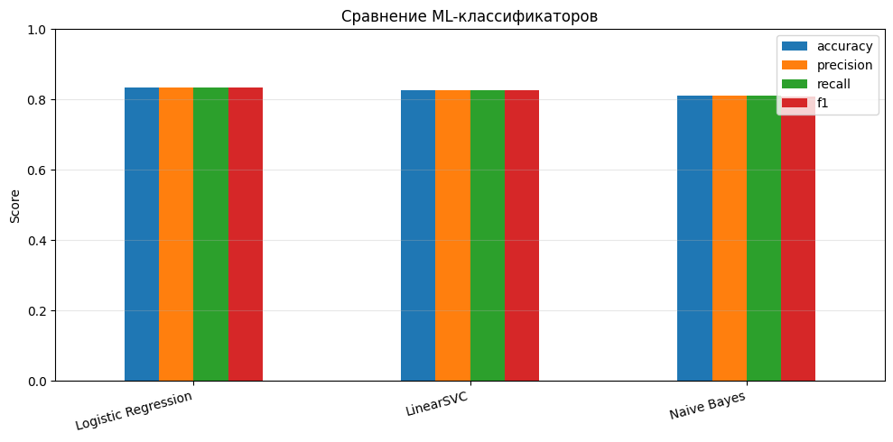
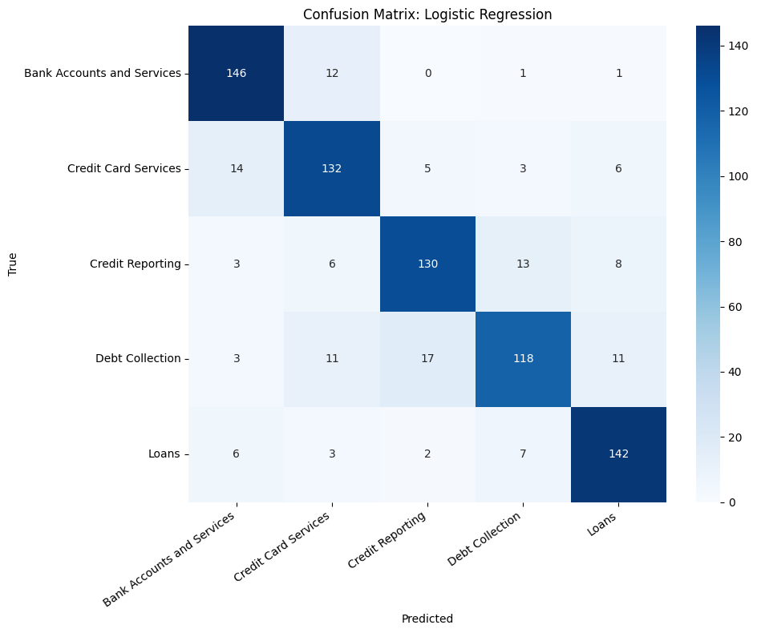
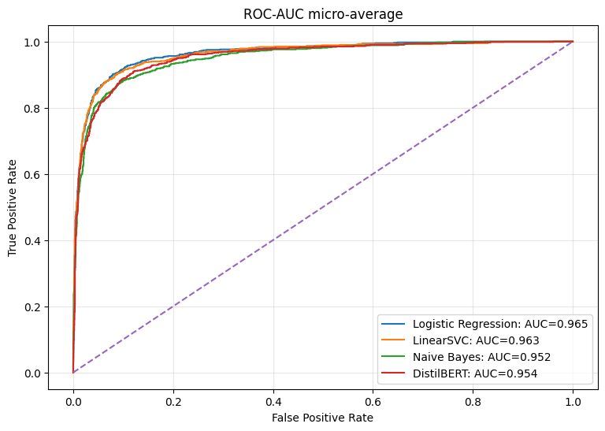
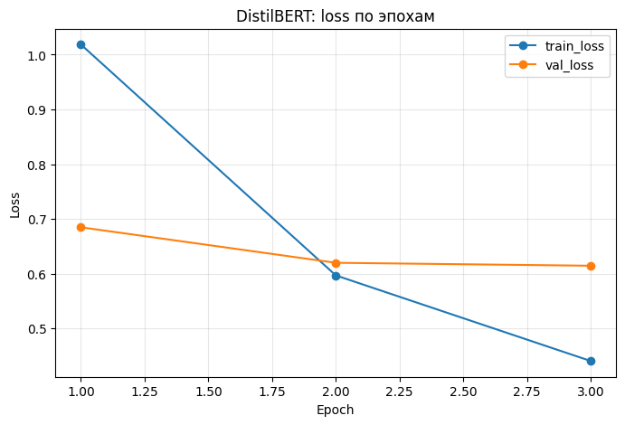

# Классификация клиентских жалоб с помощью NLP

Проект по автоматической классификации клиентских жалоб и претензий по типу проблемы.

В работе сравниваются классические NLP-подходы и Transformer-модель: **Logistic Regression**, **LinearSVC**, **Naive Bayes** и **DistilBERT**. Дополнительно исследуются тематическое моделирование `LDA` и кластеризация `K-Means`.

> **Ключевой результат:** лучшей моделью оказалась `Logistic Regression + TF-IDF` с `F1 = 0.834` и `Accuracy = 0.835`. На используемой выборке она превзошла fine-tuned DistilBERT (`F1 = 0.793`).

## Постановка задачи

Цель проекта — автоматически определять категорию клиентского обращения по его тексту.

Используются 5 классов:

- `Bank Accounts and Services`
- `Credit Card Services`
- `Credit Reporting`
- `Debt Collection`
- `Loans`

Такая постановка может использоваться для автоматической маршрутизации обращений по ответственным подразделениям и первичной аналитики клиентских проблем.

## Данные

Используется **Consumer Complaint Dataset** с Kaggle.

Исходный датасет содержит более 2 млн записей. Для эксперимента сформирована сбалансированная выборка из **4 000 жалоб** — по **800 объектов на каждый из 5 классов**.

Разбиение выполняется со стратификацией:

- train — около 3 200 объектов;
- test — 800 объектов.

Датасет загружается в notebook через `kagglehub`.

## Предобработка текста

Для текстов выполняется базовая очистка:

- приведение к нижнему регистру;
- удаление служебных последовательностей `XXXX`;
- удаление символов, кроме английских букв и пробелов;
- нормализация пробелов.

Для классических моделей тексты преобразуются в TF-IDF-признаки.

После балансировки обучающей выборки размер TF-IDF-матрицы составляет:

```text
Train: 3200 × 9000
Test:   800 × 9000
```

## Разведочный анализ

В проекте исследуются распределение категорий и длина клиентских обращений.



## Тематическое моделирование

Для анализа скрытых тематик используется `LatentDirichletAllocation` с 5 темами.

Примеры характерных слов:

```text
Topic 0: credit, consumer, report, information, reporting, account
Topic 1: card, credit, account, bank, fraud, chase, dispute
Topic 2: debt, credit, account, information, collection, report
Topic 3: loan, payment, mortgage, payments, home, pay
Topic 4: account, bank, money, payment, check, balance
```



Также исследовалась кластеризация `MiniBatchKMeans`. Она показала, что неразмеченная кластерная структура лишь частично соответствует целевым категориям, поэтому основной результат проекта строится на supervised-классификации.

## Сравнение моделей

| Модель | Accuracy | Precision | Recall | F1 |
|---|---:|---:|---:|---:|
| **Logistic Regression** | **0.835** | **0.835** | **0.835** | **0.834** |
| LinearSVC | 0.828 | 0.827 | 0.828 | 0.826 |
| Naive Bayes | 0.810 | 0.811 | 0.810 | 0.808 |
| DistilBERT | 0.795 | 0.796 | 0.795 | 0.793 |



Главный вывод эксперимента: на выборке такого размера классический подход `TF-IDF + Logistic Regression` оказался эффективнее более сложной Transformer-модели.

Это полезный результат с точки зрения выбора модели: увеличение сложности архитектуры не гарантирует улучшения качества.

## Качество лучшей модели по классам

Лучшая модель — **Logistic Regression**.

| Категория | Precision | Recall | F1-score |
|---|---:|---:|---:|
| Bank Accounts and Services | 0.85 | 0.91 | **0.88** |
| Credit Card Services | 0.80 | 0.82 | **0.81** |
| Credit Reporting | 0.84 | 0.81 | **0.83** |
| Debt Collection | 0.83 | 0.74 | **0.78** |
| Loans | 0.85 | 0.89 | **0.87** |
| **Macro avg** | **0.83** | **0.83** | **0.83** |

Наиболее сложным для модели оказался класс `Debt Collection`, где recall составляет `0.74`.

## Матрица ошибок



## ROC-AUC

Для моделей с доступными вероятностями также строятся ROC-кривые в one-vs-rest постановке.



## DistilBERT

В проекте выполнен fine-tuning модели:

```text
distilbert-base-uncased
```

Основные параметры:

```text
epochs = 3
batch_size = 8
learning_rate = 2e-5
max_length = 128
```

На validation-выборке качество улучшалось по эпохам:

| Эпоха | Accuracy | F1 |
|---|---:|---:|
| 1 | 0.772 | 0.771 |
| 2 | 0.803 | 0.804 |
| 3 | **0.811** | **0.811** |

На итоговой test-выборке DistilBERT получил `F1 = 0.793`.



## Пример использования

В конце notebook реализована функция, которая принимает текст новой жалобы и возвращает вероятности по категориям.

Пример результата:

```text
Credit Reporting            0.779
Debt Collection             0.171
Credit Card Services        0.026
Loans                       0.019
Bank Accounts and Services  0.005
```

## Основные выводы

- классические методы NLP показали высокое качество на сравнительно небольшой размеченной выборке;
- лучшим подходом оказался `TF-IDF + Logistic Regression`;
- fine-tuning DistilBERT не дал улучшения относительно классического baseline;
- тематическое моделирование позволило выделить содержательно интерпретируемые темы;
- кластеризация без учителя оказалась существенно слабее supervised-подхода для определения категорий жалоб.

## Ограничения

- для эксперимента используется ограниченная сбалансированная подвыборка исходного датасета;
- категории были укрупнены до 5 классов;
- DistilBERT обучался только 3 эпохи;
- для production-сценария необходимо дополнительно исследовать качество на естественном несбалансированном распределении данных, latency и обработку новых типов обращений.

## Структура репозитория

```text
customer-complaint-classification/
├── README.md
├── requirements.txt
├── .gitignore
├── assets/
│   ├── eda_distribution.png
│   ├── lda_topics.png
│   ├── model_comparison.png
│   ├── distilbert_training.png
│   ├── confusion_matrix_best_model.png
│   └── roc_auc_models.png
└── notebooks/
    └── customer_complaint_classification.ipynb
```

## Запуск

Установить зависимости:

```bash
pip install -r requirements.txt
```

После этого открыть:

```text
notebooks/customer_complaint_classification.ipynb
```

Для fine-tuning DistilBERT рекомендуется GPU-среда, например Google Colab.

## Стек

`Python` · `pandas` · `NumPy` · `scikit-learn` · `TF-IDF` · `LDA` · `K-Means` · `Logistic Regression` · `LinearSVC` · `Naive Bayes` · `DistilBERT` · `Transformers` · `PyTorch` · `KaggleHub`
